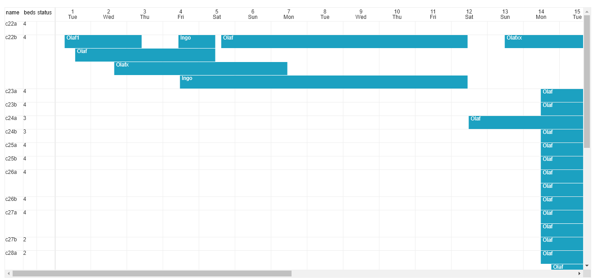

# canvastimeline
This project aims to see if canvas is a viable option for a scheduler / timeline widget versus "normal" DOM elements.

In canvas' immediate mode almost everything needs to be scheduled in the right order and calculated on a much lower level then when relying on the DOM.

It has advantages though, too and even in DOM based scheduler libraries part of the layout is usually absolutely positioned and pre/-recalculated to make perfect sense.  
Thus, the effort to build a fully fledged "thing" with canvas in the end might not be much different, but maybe will keep restricted to a certain amount of features. 

As I am not working a lot of time on this the plans I have for the moment are to add some more date "leap" methods (years not only months) and later on the option to view not only months, but also week(s) and maybe I will test year as view as well and see how that performs.  

One thing I will probably not add directly to the calendar class is buttons and controls, this should keep completely flexible and the class will provide the functions you can call whenever someone uses your user interface surrounding instances of this canvastimeline.

#What it does
+ show a flexible amount of "resources" in the left column, which is sticky.
+ within the resources you can have a flexible amount of headers which have a name and a width
+ the calendar of course adapts the number of days, daynames etc. when switching between months
+ it recalculates "everything" to match a chosen cell height and cell width.
+ the header row with the dates is also sticky
+ you can load any amount of events which will be visible when they are matching the currently chosen month
+ the events have the appropriate relative width and position according to their start and end date
+ the events will be packed to some extend but never overlap, so the cell heights keep at a minimum but events are always visible
+ changing a month empties the events which are at the moment internally attached to resources
+ I will change the way the events are internally organized to be in batches of cell height for faster indexing in the future
+ a click handler is attached to the event layer canvas and finds the event clicked (or no event when the click was not where an event is)

